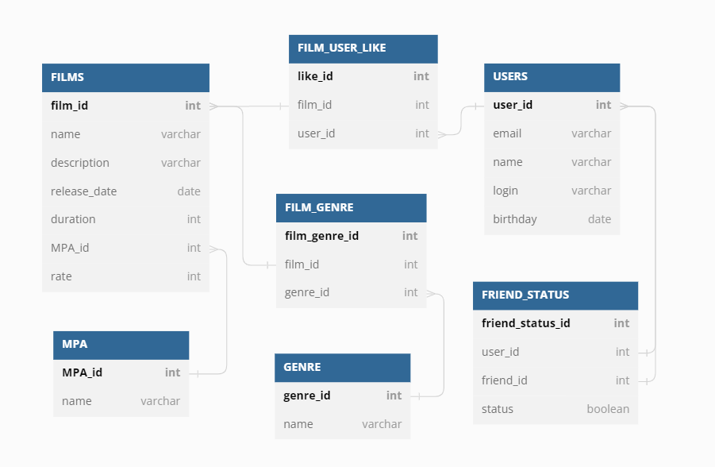

# java-filmorate

## **Таблица FILMS:**

1. FILM_ID - PRIMARY KEY AUTO INCREMENT
2. NAME
3. DESCRIPTION
4. RELEASE_DATE
5. DURATION
6. MPA_ID - FOREIGN KEY (MPA)                               
7. RATE

## Таблица USERS:

1. USER_ID - PRIMARY KEY AUTO INCREMENT
2. EMAIL
3. NAME
4. LOGIN
5. BIRTHDAY

## Таблица FILM_GENRE:

1. FILM_GENRE_ID - PRIMARY KEY AUTO INCREMENT
2. FILM_ID - FOREIGN KEY (FILMS)
3. GENRE_ID - FOREIGN KEY (GENRE)

## Таблица FILM_USER_LIKE:

1. LIKE_ID - PRIMARY KEY AUTO INCREMENT
2. FILM_ID - FOREIGN KEY (FILMS)
3. USER_ID - FOREIGN KEY (USERS)

## Таблица FRIEND_STATUS:

1. FRIEND_STATUS_ID - PRIMARY KEY AUTO INCREMENT
2. USER_ID - FOREIGN KEY (USERS)
3. FRIEND_ID - FOREIGN KEY (USERS)
4. STATUS

## Таблица GENRE:

1. GENRE_ID - PRIMARY KEY
2. NAME

## Таблица MPA:

1. MPA_ID - PRIMARY KEY
2. NAME